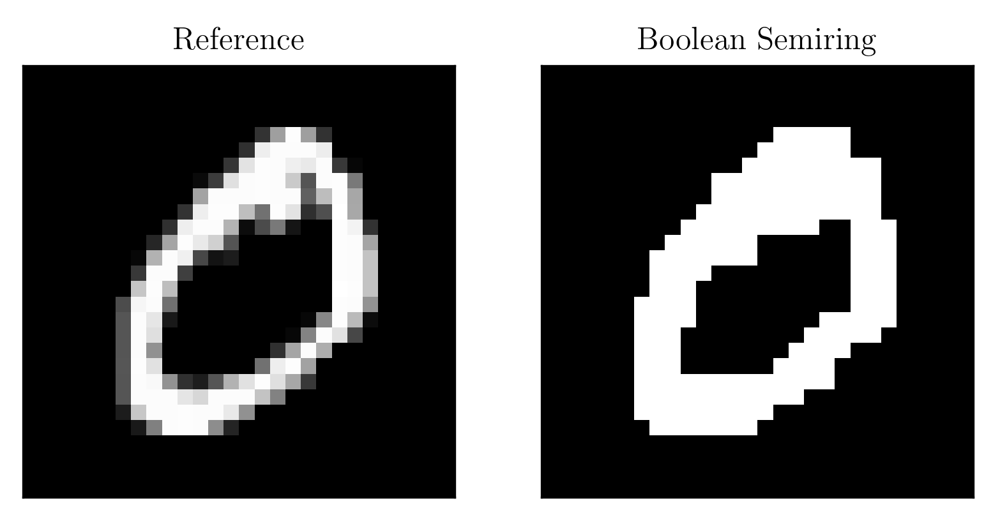
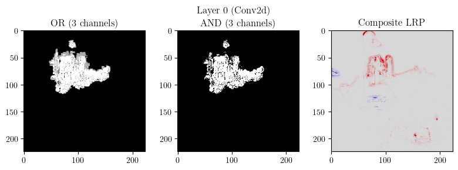

# Semiring-LRP
Code, report, and slides for my L3 Internship "Extending Layer-wise Relevance Propagation using Semiring Annotations" at [LIG](https://www.liglab.fr/en).

## Report
The PDF of the report is available at [report/report.pdf](report/report.pdf), and the $\LaTeX$ source can be found at [report/report.tex](report/report.tex). Note that the `TeX` file uses a custom class [cs-classes](https://github.com/Red-Rapious/cs-classes) as a dependency; to compile the project correctly, be sure to clone this repository with its submodule using the `--recurse-submodules` flag:
```bash
git clone --recurse-submodules https://github.com/Red-Rapious/Semiring-LRP
```

## Tutorial
The Jupyter Notebook tutorial showcasing both the code and results of the internship, is available at [tutorial/tutorial.ipynb](tutorial/tutorial.ipynb). It details a `NumPy`-based implementation of Semiring LRP for an MNIST mutlilayer perceptron and the VGG-16 model.

## Results showcase
### Figure 1: *Boolean LRP applied to an MLP trained on the MNIST dataset*


### Figure 2: *Viterbi LRP applied to an MLP trained on the MNIST dataset*


### Figure 3: *Boolean LRP applied to VGG-16*


### Figure 3: *LRP with the counting semiring applied to VGG-16*
